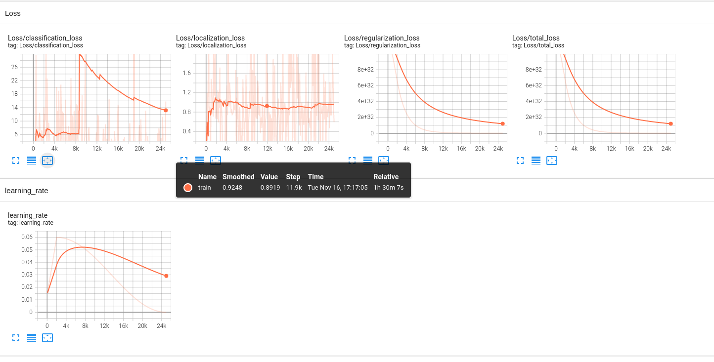
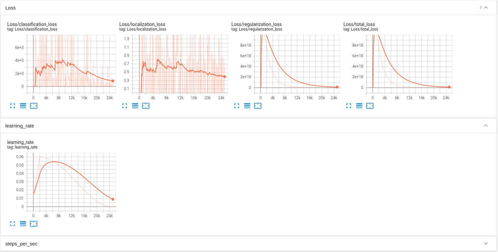

# Object detection in an Urban Environment

## Data

For this project, we will be using data from the [Waymo Open dataset](https://waymo.com/open/). The files can be downloaded directly from the website as tar files or from the [Google Cloud Bucket](https://console.cloud.google.com/storage/browser/waymo_open_dataset_v_1_2_0_individual_files/) as individual tf records. 

## Structure

The data in the classroom workspace will be organized as follows:
```
/data/waymo/
    - contains the tf records in the Tf Object detection api format.

/home/workspace/data/
    - test: contain the test data (empty to start)
    - train: contain the train data (empty to start)
    - val: contain the val data (empty to start)
```

The experiments folder will be organized as follow:
```
experiments/
    - exporter_main_v2.py: to create an inference model
    - model_main_tf2.py: to launch training
    - experiment0/....
    - experiment1/....
    - experiment2/...
    - pretrained-models/: contains the checkpoints of the pretrained models.
```

## Prerequisites

### Local Setup

For local setup if you have your own Nvidia GPU, you can use the provided Dockerfile and requirements in the [build directory](./build).

Follow [the README therein](./build/README.md) to create a docker container and install all prerequisites.

### Classroom Workspace

In the classroom workspace, every library and package should already be installed in your environment. You will not need to make use of `gcloud` to download the images.

## Instructions

### Download and process the data

**Note:** This first step is already done for you in the classroom workspace. You can find the downloaded and processed files within the `/data/waymo/` directory (note that this is different than the `/home/workspace/data` you'll use for splitting )

The first goal of this project is to download the data from the Waymo's Google Cloud bucket to your local machine. For this project, we only need a subset of the data provided (for example, we do not need to use the Lidar data). Therefore, we are going to download and trim immediately each file. In `download_process.py`, you can view the `create_tf_example` function, which will perform this processing. This function takes the components of a Waymo Tf record and saves them in the Tf Object Detection api format. An example of such function is described [here](https://tensorflow-object-detection-api-tutorial.readthedocs.io/en/latest/training.html#create-tensorflow-records). We are already providing the `label_map.pbtxt` file.

You can run the script using the following (you will need to add your desired directory names):
```
python download_process.py --data_dir {processed_file_location} --temp_dir {temp_dir_for_raw_files}
```

You are downloading 100 files so be patient! Once the script is done, you can look inside your data_dir folder to see if the files have been downloaded and processed correctly.


### Exploratory Data Analysis

Now that you have downloaded and processed the data, you should explore the dataset! This is the most important task of any machine learning project. To do so, open the `Exploratory Data Analysis` notebook. In this notebook, your first task will be to implement a `display_instances` function to display images and annotations using `matplotlib`. This should be very similar to the function you created during the course. Once you are done, feel free to spend more time exploring the data and report your findings. Report anything relevant about the dataset in the writeup.

Keep in mind that you should refer to this analysis to create the different spits (training, testing and validation). 


### Create the splits

Now you have become one with the data! Congratulations! How will you use this knowledge to create the different splits: training, validation and testing. There are no single answer to this question but you will need to justify your choice in your submission. You will need to implement the `split_data` function in the `create_splits.py` file. Once you have implemented this function, run it using:
```
python create_splits.py --data_dir /home/workspace/data/
```

NOTE: Keep in mind that your storage is limited. The files should be <ins>moved</ins> and not copied. 

### Edit the config file

Now you are ready for training. As we explain during the course, the Tf Object Detection API relies on **config files**. The config that we will use for this project is `pipeline.config`, which is the config for a SSD Resnet 50 640x640 model. You can learn more about the Single Shot Detector [here](https://arxiv.org/pdf/1512.02325.pdf). 

First, let's download the [pretrained model](http://download.tensorflow.org/models/object_detection/tf2/20200711/ssd_resnet50_v1_fpn_640x640_coco17_tpu-8.tar.gz) and move it to `training/pretrained-models/`. 

Now we need to edit the config files to change the location of the training and validation files, as well as the location of the label_map file, pretrained weights. We also need to adjust the batch size. To do so, run the following:
```
python edit_config.py --train_dir /home/workspace/data/train/ --eval_dir /home/workspace/data/val/ --batch_size 4 --checkpoint ./training/pretrained-models/ssd_resnet50_v1_fpn_640x640_coco17_tpu-8/checkpoint/ckpt-0 --label_map label_map.pbtxt
```
A new config file has been created, `pipeline_new.config`.

### Training

You will now launch your very first experiment with the Tensorflow object detection API. Create a folder `training/reference`. Move the `pipeline_new.config` to this folder. You will now have to launch two processes: 
* a training process:
```
python model_main_tf2.py --model_dir=training/reference/ --pipeline_config_path=training/reference/pipeline_new.config
```
* an evaluation process:
```
python model_main_tf2.py --model_dir=training/reference/ --pipeline_config_path=training/reference/pipeline_new.config --checkpoint_dir=training/reference/
```

NOTE: both processes will display some Tensorflow warnings.

To monitor the training, you can launch a tensorboard instance by running `tensorboard --logdir=training`. You will report your findings in the writeup. 

### Improve the performances

Most likely, this initial experiment did not yield optimal results. However, you can make multiple changes to the config file to improve this model. One obvious change consists in improving the data augmentation strategy. The [`preprocessor.proto`](https://github.com/tensorflow/models/blob/master/research/object_detection/protos/preprocessor.proto) file contains the different data augmentation method available in the Tf Object Detection API. To help you visualize these augmentations, we are providing a notebook: `Explore augmentations.ipynb`. Using this notebook, try different data augmentation combinations and select the one you think is optimal for our dataset. Justify your choices in the writeup. 

Keep in mind that the following are also available:
* experiment with the optimizer: type of optimizer, learning rate, scheduler etc
* experiment with the architecture. The Tf Object Detection API [model zoo](https://github.com/tensorflow/models/blob/master/research/object_detection/g3doc/tf2_detection_zoo.md) offers many architectures. Keep in mind that the `pipeline.config` file is unique for each architecture and you will have to edit it. 


### Creating an animation
#### Export the trained model
Modify the arguments of the following function to adjust it to your models:
```
python .\exporter_main_v2.py --input_type image_tensor --pipeline_config_path training/experiment0/pipeline.config --trained_checkpoint_dir training/experiment0/ckpt-50 --output_directory training/experiment0/exported_model/
```

Finally, you can create a video of your model's inferences for any tf record file. To do so, run the following command (modify it to your files):
```
python inference_video.py -labelmap_path label_map.pbtxt --model_path training/experiment0/exported_model/saved_model --tf_record_path /home/workspace/data/test/tf.record --config_path training/experiment0/pipeline_new.config --output_path animation.mp4
```

## Submission Template

### Project overview
Our goal in this project is to identify objects (vehicle, pedestrian, cyclist) that may be important for autonomous driving. Deep learning algorithms are used to detect objects. Deep learning algorithms are more successful in object detection than image processing and classical machine learning algorithms. The biggest reason for this is that feature extraction in deep learning models is done with artificial neural networks (convolutional layers). 

The dataset used for this purpose is Waymo which can be downloaded from the [Google Cloud Storage Bucket]((https://console.cloud.google.com/storage/browser/waymo_open_dataset_v_1_2_0_individual_files/) In this case, we will be using tfrecord files which we will be modified into tf.Train.Example for the object detection api format. We will also be splitting the dataset into training, validation and testing sets using np.split in "create_splits.py" python program.

### Set up
As mentioned in the project rubrics, GPU compatible system should be present for this. In my case, I have used Nvidia Geforce RTX A4000.

   * First the project files should be downloaded through git clone from [this](https://github.com/udacity/nd013-c1-vision-starter) repository
   * Navigate to the root directory of the project and use the docker file and requirements.txt from the "build" directory
   * The following command should be run from inside the "build" directory:
    ``` docker build -t project-dev -f Dockerfile .```
   * Then we create a docker container to run the created image.
    ``` 
    docker run --gpus all -v <PATH TO LOCAL PROJECT FOLDER>:/app/project/ --network=host -ti project-dev bash
   ```
   * Inside the container, we can use the gsutil command to download the tfrecord from cloud storage:
    ``` 
    curl https://sdk.cloud.google.com | bash
   ```
   -Authentication can be done using
   ```
    pip install tensorflow-gpu==2.3.0
    pip install numpy
    pip install pandas
    pip install matplotlib
    pip install seaborn 
   ```

### Dataset
#### Dataset analysis
In the dataset, we have to fit rectangular bounding boxes on the images with objects ,which includes pedestrians, cyclists and cars.Images are taken from different places, and different weather conditions and at different time of the day (day/night).The image set contains diverse set of images of which some are blurry, clear, light and some are dark. A sample image in dark and foggy background is provided below


It is also important how many objects of each class are in the dataset. Below is the distribution of the dataset according to the classes.


#### Cross validation
In order for the model to generalize well, the dataset should be randomly distributed. It is divided into 80% train, 20% validation, 20% test. in this project create_split.py provides random distribution of dataset. 

#### Edit the config file

Now you are ready for training. As we explain during the course, the Tf Object Detection API relies on config files. The config that we will use for this project is pipeline.config, which is the config for a SSD Resnet 50 640x640 model. You can learn more about the Single Shot Detector here.

First, let's download the [pretrained model](download.tensorflow.org/models/object_detection/tf2/20200711/ssd_resnet50_v1_fpn_640x640_coco17_tpu-8.tar.gz) and move it to training/pretrained-models/.

Now we need to edit the config files to change the location of the training and validation files, as well as the location of the label_map file, pretrained weights. We also need to adjust the batch size. To do so, run the following:
``` 
python edit_config.py --train_dir app/project/data/train/ --eval_dir app/project/data/val/ --batch_size 4 --checkpoint ./training/pretrained-models/ssd_resnet50_v1_fpn_640x640_coco17_tpu-8/checkpoint/ckpt-0 --label_map label_map.pbtxt  
```
A new config file has been created, pipeline_new.config. Moved pipeline_new.config to `/training/reference/` file path.

### Training 

The reference experiment uses the `ssd_resnet50_v1_fpn_640x640_coco17_tpu-8` pretrained model as a baseline and uses the default training parameters in the `pipeline.config`. 

The residual network model (Resnet), model loss is shown below:
* a training process:
```
python experiments/model_main_tf2.py --model_dir=training/reference/ --pipeline_config_path=training/reference/pipeline_new.config

```
* an evaluation process:
```
python experiments/model_main_tf2.py --model_dir=training/reference/ --pipeline_config_path=training/reference/pipeline_new.config --checkpoint_dir=training/reference/
```

* To monitor the training, you can launch a tensorboard instance by running tensorboard --logdir=training. And these are my results.


Here it shows the error in classification classification loss. In other words, we can see how successful the model is in classifying the objects it detects by looking here. On the other hand, we see the error of localization loss in correctly locating the objects detected by our model. ( In the `ssd_resnet_50` model we use, the resnet model makes classification, while the SSD algorithm provides the location of the objects.) The total loss shows us what our total error is in these two.

Training continued until we were sure that the loss was sufficiently low. In addition, it was ensured that there was no overtrain and the training was completed at a point where the loss did not start to increase.

#### Experiment 1: Resnet 101

In this experiment, a deeper network `ssd_resnet101_v1_fpn_640x640_coco17_tpu-8` is used to replace Resnet50. As can be seen in the loss chart below, it is seen that the total loss decreases faster. 

The actually training process is as follows, the baseline being orange.


#### Experiment 2: Resnet 152

In this experiment, a deeper network `ssd_resnet152_v1_fpn_640x640_coco17_tpu-8` is used to replace Resnet101. We expect training with this model to yield better results. As can be seen in the loss chart below, it is seen that the total loss decreases faster. 



#### Experiment 3: Augmentation

For the model to learn well, the dataset should represent as many different scenarios as possible. For this purpose, the duplication of the data set with applications such as the luminance level, rotation, and cutting of a part of the image is called augmentation. Random_horizontal_flip and random_crop_image augmentations were applied in the original config file of the model. In addition, I did the training by applying random_distort_color and observed the results.
I did this by adding the following lines to the configuration file.


random_distort_color could help combat against color space distortions such as lighting. This change was made using the `ssd_resnet50_v1_fpn_640x640_coco17_tpu-8` model used in my reference network. It is seen that the loss decreases faster when augmentation is applied.



#### Important Points

Correct selection of hyperparameters is very critical when training.

Keep in mind that the following are also available:

    * experiment with the optimizer: type of optimizer, learning rate, scheduler etc
    * experiment with the architecture. The Tf Object Detection API model zoo offers many architectures. Keep in mind that the pipeline.config file is unique for each architecture and you will have to edit it.
    * In training, choose the batch size as large as possible. (This app has not been tested. This information is transferred based on literature reviews and previous experiences.)
    
#### Creating an animation

Export the trained model. Now we can test it on real images.

Modify the arguments of the following function to adjust it to your models:
```
python .\exporter_main_v2.py --input_type image_tensor --pipeline_config_path training/experiment0/pipeline.config --trained_checkpoint_dir training/experiment0/ckpt-50 --output_directory training/experiment0/exported_model/
```
Finally, you can create a video of your model's inferences for any tf record file. To do so, run the following command (modify it to your files):
```
python inference_video.py -labelmap_path label_map.pbtxt --model_path training/experiment0/exported_model/saved_model --tf_record_path /app/project/data/test/*.tf.record --config_path training/experiment0/pipeline_new.config --output_path animation.mp4

```


