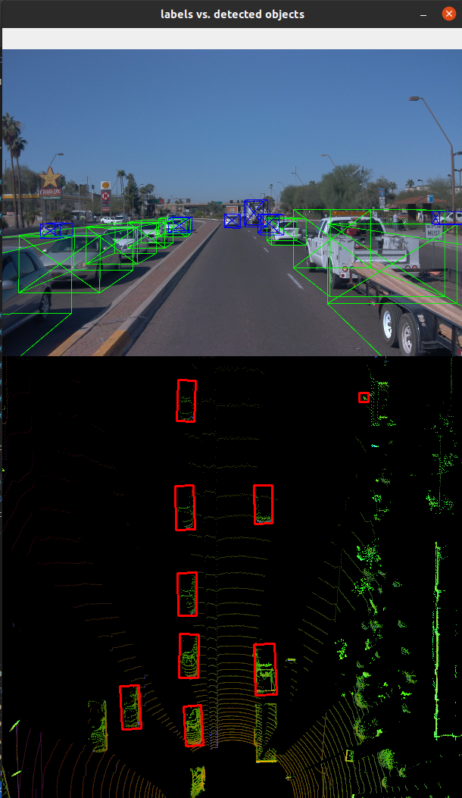

# Self-Driving Car Beta Testing Nanodegree

This is a template submission for the midterm second course in the Udacity Self-Driving Car Engineer Nanodegree Program : 3D Object Detection (Midterm).

## 3D Object detection

We have used the Waymo Open Dataset's real-world data and used 3d point cloud for lidar based object detection.

    Configuring the ranges channel to 8 bit and view the range /intensity image (ID_S1_EX1)
    Use the Open3D library to display the lidar point cloud on a 3d viewer and identifying 10 images from point cloud.(ID_S1_EX2)
    Create Birds Eye View perspective (BEV) of the point cloud,assign lidar intensity values to BEV,normalize the heightmap of each BEV (ID_S2_EX1,ID_S2_EX2,ID_S2_EX3)
    In addition to YOLO, use the repository and add parameters ,instantiate fpn resnet model(ID_S3_EX1)
    Convert BEV coordinates into pixel coordinates and convert model output to bounding box format (ID_S3_EX2)
    Compute intersection over union, assign detected objects to label if IOU exceeds threshold (ID_S4_EX1)
    Compute false positives and false negatives, precision and recall(ID_S4_EX2,ID_S4_EX3)

The project can be run by running

``` 
python loop_over_dataset.py
```


## Step-1: Compute Lidar point cloud from Range Image

In this we are first previewing the range image and convert range and intensity channels to 8 bit format. After that, we use the openCV library to stack the range and intensity channel vertically to visualize the image.

    Convert "range" channel to 8 bit
    Convert "intensity" channel to 8 bit
    Crop range image to +/- 90 degrees left and right of forward facing x axis
    Stack up range and intensity channels vertically in openCV

The changes are made in 'loop_over_dataset.py'


The changes are made in "objdet_pcl.py"


The range image sample:


For the next step, we view the lidar point cloud in 3D. We use the open3D library for this.

    Visualize the point cloud in Open3D
    10 examples from point cloud with varying degrees of visibility

The changes are made in 'loop_over_dataset.py' </br>


The changes are made in "objdet_pcl.py" 


Point cloud images


Lidar, which stands for Light Detection and Ranging, is a remote sensing method that uses light in the form of a pulsed laser to measure ranges. In this way, it allows us to have 3D information about the environment we are in.In this part, the lidar data is displayed as a point cloud. Above you can see how different vehicles look in point cloud. You can see that there are some losses in the lidar data in the light-permeable areas such as the wind shield of the vehicles. We see that the regions outside of this(wheel, bumper) are clearly visible with lidar

## Step-2: Creaate BEV from Lidar PCL

In this case, we are:

    Converting the coordinates to pixel values
    Assigning lidar intensity values to the birds eye view BEV mapping
    Using sorted and pruned point cloud lidar from the previous task
    Normalizing the height map in the BEV
    Compute and map the intensity values

The changes are in the 'loop_over_dataset.py' </br>


The changes are also in the "objdet_pcl.py"


A sample preview of the BEV: </br>


## Step-3: Model Based Object Detection in BEV Image

Here we are using the cloned repo ,particularly the test.py file and extracting the relevant configurations from 'parse_test_configs()' and added them in the 'load_configs_model' config structure.

    Instantiating the fpn resnet model from the cloned repository configs
    Extracting 3d bounding boxes from the responses
    Transforming the pixel to vehicle coordinates
    Model output tuned to the bounding box format [class-id, x, y, z, h, w, l, yaw]

The changes are in "loop_over_dataset.py" </br>


The changes for the detection are inside the "objdet_detect.py" file:


As the model input is a three-channel BEV map, the detected objects will be returned with coordinates and properties in the BEV coordinate space. Thus, before the detections can move along in the processing pipeline, they need to be converted into metric coordinates in vehicle space.

A sample preview of the bounding box images:  </br>



## Step-4: Performance detection for 3D Object Detection

In this step, performance is calculated by taking the IOU between tags and detections to get false positive and false negative values. The IOU is a parameter that determines how accurately the regions where the detected object is located. The task is to calculate the geometric overlap between the bounding label boxes and the detected objects:

    Assigning a detected object to a label if IOU exceeds threshold
    Computing the degree of geometric overlap
    For multiple matches objects/detections pair with maximum IOU are kept
    Computing the false negative and false positive values
    Computing precision and recall over the false positive and false negative values

The changes in the code are:


The changes for "objdet_eval.py" where the precision and recall are calculated as functions of false positives and negatives:


The precision recall curve is plotted showing similar results of precision and recall.


In the next step, we set the <br/>
``` 
configs_det.use_labels_as_objects=True
``` 


###  Summary of Lidar based 3D Object Detection

Within the scope of this project, 3D object detection was carried out. Lidar provides very efficient information for 3D imaging of objects. In the next step, the infrastructure prepared in this project will be used to track objects.


