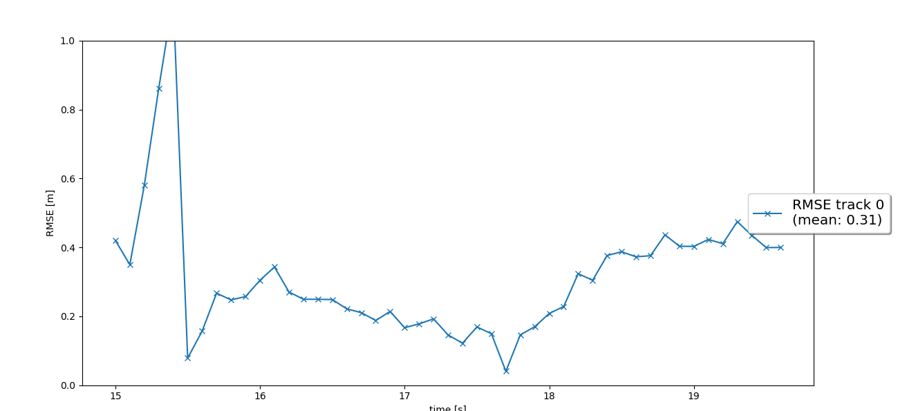
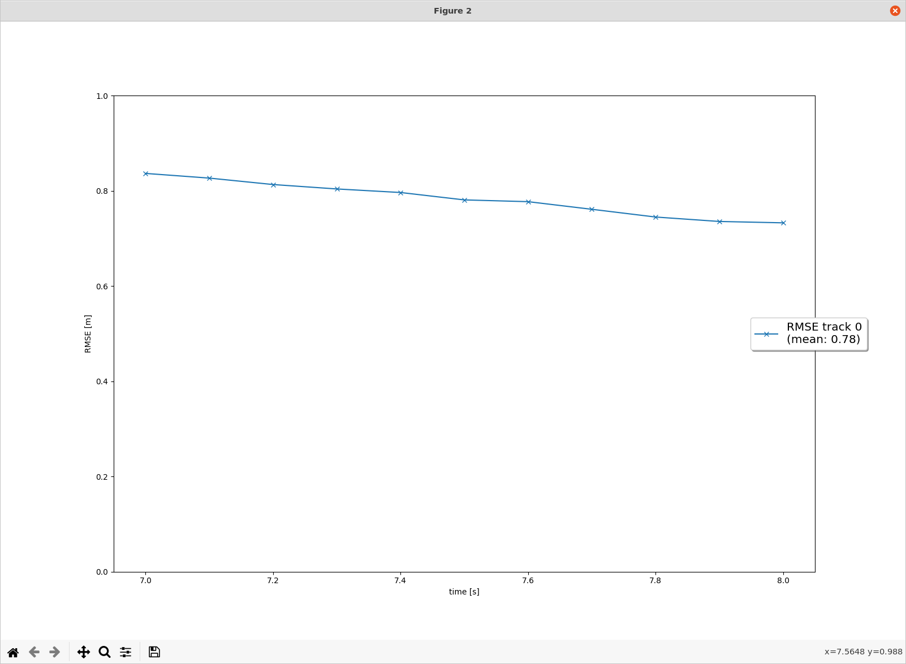
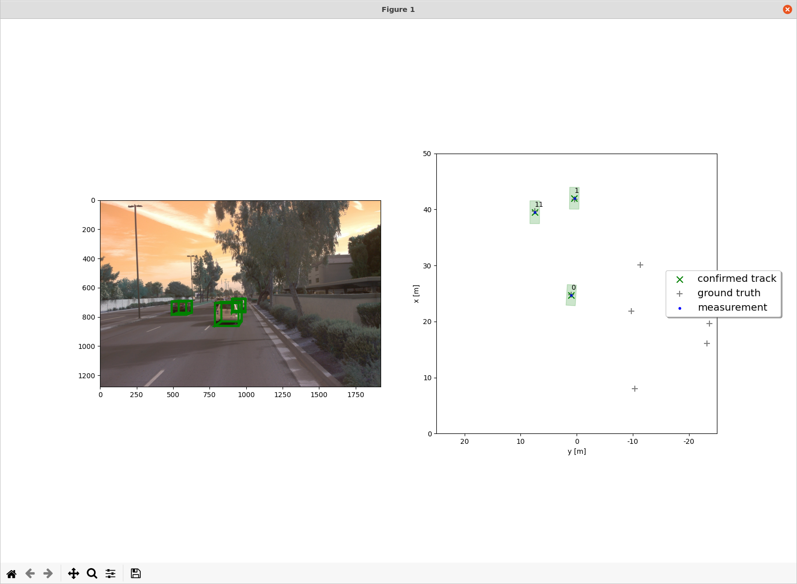
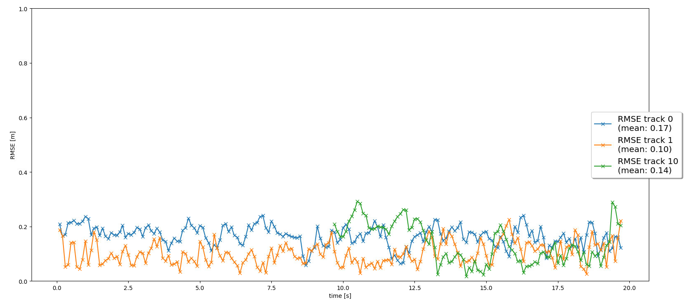

# Writeup: Track 3D-Objects Over Time

Please use this starter template to answer the following questions:

### 1. Write a short recap of the four tracking steps and what you implemented there (filter, track management, association, camera fusion). Which results did you achieve? Which part of the project was most difficult for you to complete, and why?


### 2. Do you see any benefits in camera-lidar fusion compared to lidar-only tracking (in theory and in your concrete results)? 


### 3. Which challenges will a sensor fusion system face in real-life scenarios? Did you see any of these challenges in the project?


### 4. Can you think of ways to improve your tracking results in the future?


# Self-Driving Car Beta Testing Nanodegree 

This is a template submission for the  second course in the  [Udacity Self-Driving Car Engineer Nanodegree Program](https://www.udacity.com/course/c-plus-plus-nanodegree--nd213) : Sensor Fusion and Tracking. 


## Sensor Fusion and Object detection

We have used the [Waymo Open Dataset's](https://console.cloud.google.com/storage/browser/waymo_open_dataset_v_1_2_0_individual_files) real-world data and applied an extended Kalman fusion filter for tracking several vehicles in this project. The following are the tasks completed:
- Building Kalman Filter system to track an object
- Object tracking and updating tracks (creating and deleting)
- Understanding the association between the data (sensor)
- Added camera sensor fusion based on lidar fusion 

The project can be run by running 

```
python loop_over_dataset.py
```

## Step-1: Extended Kalman Filter

The first step is to implement an extended Kalman filter. There are basically two steps: predict and measure. The prediction step is to predict x and P based on the motion model. The measurement step is to update x and P based on the measurement error and the covariances.

RMSE of lidar tracking




## Step-2: Track Management

The second step is to implement the tracking lifecycle management, i.e., calculating the tracking score and switching between the initialized, tentative, and confirmed states.

The following steps were taken for this:

- The track is first initialized with unassigned lidar calculation
- If the scores on the track are correlated with measurement, then the corresponding scores will be increased and vice versa
- There is a track ranking which changes the conditions of the track.
- If the score is below certain three-point and the state balance is greater than a threshold , then the track is not removed for further consideration.


The following image shows the rmse plot for single tracking .




## Step-3: Data Association

The thrid step is to implement the association of measurements to tracks and to handle unassociated tracks and measurements. We use a single nearest neighbor data association measured by Mahalanobis distance and use gating to ease associations.

- We build  a matrix with all tracks and overviews open.
- We calculate the distance of Mahalanobis Distance for each track measurement.
- To exclude unlikely track pairs, use the hypothesis test Chi-Square.
- We choose the pair with the smallest Mahalanobis Distance, update Kalman Filter, and delete the relation matrix with the appropriate row and column.

The following image shows the MHD being applied for getting the closest track measurement:


The following graph is plotted.




## Step-4: Camera Sensor fusion

The fourth step is to implement camera fusion. We extend the extended Kalman filter to support the non-linear transformation of the camera measurement. Calculating the Jacobian matrix is the most difficult, though it's given in the project.


## Difficulties Faced in Project

The implementation of ekf, track management, data association, and camera-lidar fusion are all well guided in the lectures. However it was difficult to implement the camera measuring model. When projecting a 3d point into a 2d point, there are transformations in the camera axis. However, the coding of the project was discovered and the problem was solved.For the project, a pre-computed result is needed. However, the pre-computed result files do not correspond to the load filename of the loop_over_dataset.py file. For using the files, we  modified the filenames according to the pre-computed result. This is shown in the following lines in the "loop_over_dataset.py " file.
Use camera measurement to update state X and state covariance matrix P


## Benefits in Camera-Lidar Fusion tracking over Lidar-only tracking

From the project, it is understandable that for a stabilized tracking, sensor fusion should combine multiple sensors. Cameras may offer textured and color/brightness/contrast based imaages that Lidar does not provide .Lidar is extremely beneficial for low brightness /visibility or in blurry conditions such as foggy/rainy weather conditions.The most important aspect of Lidar is the spatial projection which is better than a camera.Lidar can seemlessly navigate to the required orientation. Ideally a combined approach of Resnet architectures combined with Lidar can provide better results. Inclusion of camera fusion trackign can produce a better geometric project matrix for the sensors to detect and operate on.
The first picture below is lidar-only detection. The second picture is camera-lidar fusion detection. We can find that tracks in second picture all have slightly lower RMS error.




## Real-life challenges:

In real-life scenarios:

* Sensor performance could be heavily affected by working environments. For example, rain, heavy fog.
* Sensor position may be changed from its original position which affects sensor to vehicle coordinates translation.
* More vehicles may in the lanes

## Improvement opportunity:
* Fine-tune parameters such as process noise Q, measurement noise R, initial setting for estimation error covariance P.
* Increase frame rate to reduce uncertainty in estimation.
